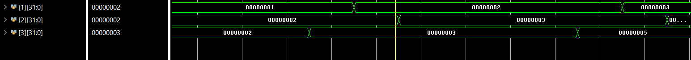
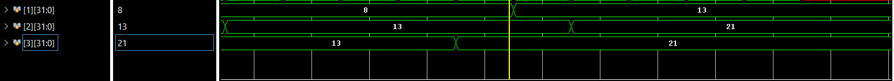
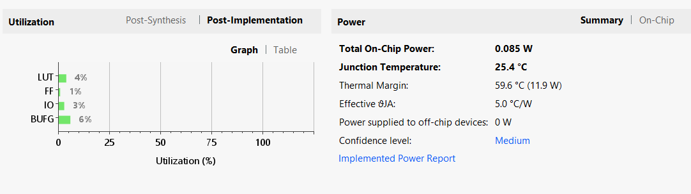
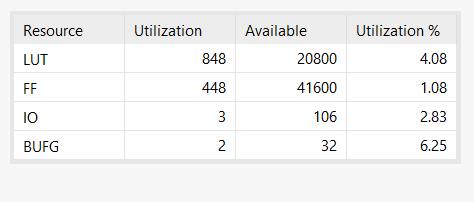

# SINGLE CYCLE RV32I IMPLEMENTATION IN FPGA

In this project, we have implemented RISC-V with base instructions \(RV32I\) in Vivado. The processor was implemented in the Basys 3 Artix 7 FPGA board. All the base instructions were implemented except 3 \(ecall, ebreak, and fence\). They were also tested using two programs: one for checking all instructions and the other for finding the nth Fibonacci number.


## BLOCK DIAGRAM


## MODULES IMPLEMENTED
- *ALU*- Performs arithmetic and logic operations (e.g., addition, subtraction, AND, OR) on two input operands.

- *INSTRUCTION MEMORY*- Stores the machine code instructions.

- *CONTROL UNIT*- A combinational logic block that generates all control signals for the data path based on the fields of the current instruction.

- *DATA SIGN EXTEND*- Based on the signed or unsigned load, the result is provided accordingly in the RESULTMUX.

- *DATA MEMORY*- Stores program data. It's a read/write memory.

- *EXTEND*- Processes the immediate field of the instruction to produce the correct 32-bit immediate value for the ALU or branch target calculation.

- *REGISTER FILE*- A collection of 32 general-purpose registers used to store operands and results.

- *PROGRAM COUNTER*- A register that holds the memory address of the next instruction to be fetched. It is updated on every clock cycle.

## INSTRUCTIONS AVAILABLE

 ### Arithmetic, R-type
 - add
 - sub
 - xor
 - or
 - and
 - sll
 - srl
 - sra
 - slt
 - sltu
 ### Arithmetic, I-type 
 - addi
 - xori
 - ori
 - andi
 - slli
 - srli
 - srai
 - slti
 - sltiu
 ### Control, Branch-beq
 - bne
 - blt
 - bge
 - bltu
 ### Load Immediate:
 - aupic
 - lui
 ### Control, Jump
 - jal 
 - jalr
 ### Memory
 - lb
 - lh
 - lw
 - lbu
 - lhu
 - sb
 - sh
 - sw

## TEST AND RESULT

### Test Code
``` Assembly
# This algorithm computes the Fibonacci numbers by keeping track
# of the most recent two numbers and adding them repeatedly

# Initialize registers with first Fibonacci numbers
addi x1, zero, 0
addi x2, zero, 1

# Loop 7 times to compute the 7th Fibonacci number
addi x10, zero, 7

fib:
    ble x10, zero, done

    # Add x1 and x2 and update the Fibonacci numbers registers
    add x3, x1, x2
    mv x1, x2
    mv x2, x3

    # Decrement the loop counter and jump back
    addi x10, x10, -1
    j fib

done:
    mv x10, x1 
```

### Result



## POWER AND UTILIZATION
The power and utilization results provided by Vivado are included here after the implementation process.




Important point: During synthesis, for the Fibonacci program, since most of the registers are not used, they were removed with other unused components automatically. 

## IMPROVEMENTS THAT CAN BE MADE
- Testbench can be included to make testing much easier.
- The naming can be made uniform to avoid confusion.
- The hardware can be further optimized based on the time availability for the project.

## CONCLUSION

This project was undertaken through numerous trials and errors. We learnt a lot about implementing a processor. This open-source code helps others who want to try implementing a RISC-V processor.

